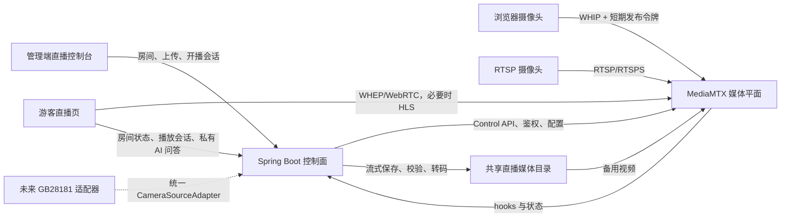

# 景区点位真实直播间设计

## 文档状态

- 日期：2026-07-15
- 状态：产品与技术设计已确认
- 适用范围：`frontend-admin`、`frontend-visitor`、`backend-java`、本地媒体基础设施
- 用户已确认：两类摄像头最终均支持；首版不做公开直播社交；摄像头断流自动切备用视频；采用 MediaMTX 分阶段路线；管理端与游客端布局按已确认线框图实施

## 背景

当前“数字人直播”是单一全局文案时间轴：管理员发布文案快照，游客端按服务器时间计算当前文案，通过 TTS 和 Live2D 在本地播放。系统没有真实视频上传、浏览器摄像头推流、RTSP 摄像头接入、点位直播间或媒体服务器。

本次把直播升级为“每个已配置景区点位最多一个直播间”。管理员按需为点位创建直播间，不自动给全部点位回填房间。管理员可以为点位上传备用视频，也可以通过本机浏览器摄像头或固定 IP 摄像头开播。游客从地图进入对应点位直播间，优先观看实时画面；摄像头离线时自动播放该点位的备用视频。

现有文案直播数据和接口保留，避免破坏历史数据，但不再作为新点位直播间的主画面。

## 已确认的产品边界

### 本次目标

- 每个 `ScenicFacility` 可以不配置直播间；一旦配置，最多关联一个直播间。
- 管理员能够创建、编辑、启停和查看点位直播间。
- 管理员能够上传一个已标准化的备用视频并查看处理状态。
- 管理员能够使用本机浏览器摄像头和麦克风开播。
- 管理员能够配置 RTSP/RTSPS 固定摄像头。
- 摄像头断流后自动切到备用视频，恢复后自动切回实时画面。
- 游客能够从地图点位进入对应直播间。
- `/live` 无点位参数时展示当前可用直播间列表。
- 游客直播页保留现有私有 AI 文字和语音问答。
- 页面始终明确标注当前是“实时画面”还是“备用视频”。
- 预留 GB28181 接入边界，后续增加媒体与 SIP 设备平台时不修改直播间公共契约。

### 非目标

- 不做公开评论、公开弹幕、点赞、礼物、关注或公开在线人数。
- 不做游客连麦、多人会议或管理员远程云台控制。
- 不做直播录制、回放管理或 CDN 分发。
- 不在本阶段交付完整 GB28181 设备注册、目录、Invite 和信令平台。
- 不将游客的私有 AI 问答广播给其他游客。
- 不删除或强制迁移现有文案直播表。

## 技术路线决策

### 选择：MediaMTX 分阶段媒体平面

采用固定版本的 MediaMTX 作为媒体平面，Spring Boot 继续作为业务控制面。

选择原因：

- MediaMTX 原生支持浏览器 WebRTC/WHIP 推流、RTSP 摄像头、WHEP/WebRTC 和 HLS 播放。
- 一个 MediaMTX path 可以稳定映射一个点位直播间。
- Control API、HTTP/JWT 鉴权和 hooks 能与现有 Spring Boot 权限体系组合。
- `alwaysAvailable` 可以在真实发布者离线时循环播放离线片段，并在发布者恢复后切回。
- 单一可执行程序和 Docker 镜像便于当前项目本地落地。

实施时固定到经过集成验证的镜像版本，初始目标版本为 `bluenviron/mediamtx:1.19.2`，升级必须重新执行媒体集成测试。

官方参考：

- [浏览器发布](https://mediamtx.org/docs/publish/web-browsers)
- [浏览器播放](https://mediamtx.org/docs/read/web-browsers)
- [自动离线片段](https://mediamtx.org/docs/features/always-available)
- [鉴权](https://mediamtx.org/docs/features/authentication)
- [Control API](https://mediamtx.org/docs/features/control-api)

### 未选择的路线

- ZLMediaKit 一次覆盖全部协议：协议面更完整并支持 GB28181 媒体接收，但首期设备、端口、SIP 平台和主备编排成本更高。
- SRS 加 FFmpeg：能覆盖 WebRTC/HLS/GB28181，但 RTSP 接入和备用视频通常需要额外 FFmpeg 进程治理，当前项目运维面更大。
- 浏览器点对点 WebRTC：缺少稳定的多观众分发、IP 摄像头接入、鉴权和主备切换，不适合作为直播间基础设施。

## 总体架构



### 控制面职责

Spring Boot 负责：

- 直播间和媒体源持久化。
- 点位唯一性、状态机和并发控制。
- 管理员权限、游客权限、发布令牌和播放令牌。
- 视频流式上传、文件校验、媒体探测、标准化和失败清理。
- 使用有界后台执行器调度媒体处理任务，并在服务重启后重新排队未完成任务。
- RTSP 凭据加密与脱敏。
- MediaMTX path 配置、hooks 接收、状态对账和故障展示。
- 对管理端和游客端输出不包含内部机密的 DTO。

Spring Boot 不直接代理持续视频字节，也不在请求线程内承担实时转码。

### 媒体平面职责

MediaMTX 负责：

- 浏览器摄像头 WHIP 发布。
- 固定摄像头 RTSP/RTSPS 拉流。
- WHEP/WebRTC 和 HLS 输出。
- path 级发布和读取鉴权。
- 发布者上下线事件、连接状态和 Control API。
- 在媒体轨道兼容时维持 `alwaysAvailable` 主备切换。

### 存储与处理职责

- 本地开发使用 `storage/live/rooms/{roomId}/`，由后端和 MediaMTX 通过只需最小权限的共享卷访问。
- 上传先写入同房间的隔离临时目录，成功处理后再原子移动到正式位置。
- 后端不得使用 `MultipartFile.getBytes()` 读取完整视频。
- 上传接口只负责流式落盘和创建 `PROCESSING` 媒体源，随后返回 `202 Accepted`；有界 `MediaProcessingExecutor` 在后台调用 FFprobe/FFmpeg。服务重启时，遗留 `UPLOADING` 任务标记失败，遗留 `PROCESSING` 任务重新排队。
- `MediaProcessingExecutor` 默认最多并行两个任务，单任务最长 1800 秒；使用 `ProcessBuilder` 直接执行固定路径程序和服务端构造的参数，不经过 shell，也不接受客户端命令片段。
- 输入允许 MP4、MOV 和 WebM；是否有效以文件特征和 FFprobe 结果为准，不信任扩展名或请求 `Content-Type`。
- 默认上传上限为 500 MB，通过 `LIVE_VIDEO_MAX_SIZE` 配置覆盖。
- 每个上传视频生成两个受控产物：H.264 Baseline、720p、25 fps、无 B 帧、两秒 GOP、Opus 48 kHz 的 `offline-webrtc.mp4`，用于 WHEP 和 `alwaysAvailable`；H.264/AAC 的 `fallback-browser.mp4`，用于浏览器原生 `<video>` 最终兜底。
- 浏览器发布会话只接受 H.264/Opus 规范轨道；无法协商该轨道时不开始发布并显示明确错误。
- RTSP 源若已满足规范可直接接入；否则由受监督的 FFmpeg 进程正规化后发布到房间输出 path。
- RTSP 正规化进程由 `MediaProcessSupervisor` 按 roomId 和 generation 管理；异常退出最多重启五次，间隔为 1、2、4、8、16 秒，超过后进入 `ERROR` 并保留备用视频。
- HLS 只在当前媒体轨道能被目标浏览器解码时返回给游客端；否则直接从 WHEP 降级到签名 `fallback-browser.mp4`。
- 若媒体轨道仍无法满足 MediaMTX 无重编码拼接条件，正确性由控制面和游客播放器切换到签名 MP4 保证；`alwaysAvailable` 仅作为连接连续性优化，不能成为唯一故障恢复手段。

## 领域模型

### `LiveRoom`

- `id`
- `facilityId`：关联 `ScenicFacility.id`，唯一且非空。
- `name`
- `mediaPath`：服务端以至少 128 位随机 route key 生成，例如 `live/r_7f3...`，唯一、不可枚举且不可由客户端指定。
- `enabled`
- `primarySourceId`
- `fallbackSourceId`
- `actualSourceId`
- `status`
- `actualSourceType`
- `mediaGeneration`：主源、备用源、启停或媒体配置变化时单调递增。
- `statusRevision`：每次成功对账并改变状态时单调递增。
- `lastLiveAt`
- `lastStatusChangedAt`
- `lastReconciledAt`
- `lastErrorCode`
- `createdAt`、`updatedAt`
- `version`：JPA 乐观锁版本。

数据库必须为 `facility_id` 和 `media_path` 建唯一约束。应用层检查只用于友好报错，不能替代数据库约束。

### `LiveMediaSource`

- `id`
- `roomId`
- `type`
- `name`
- `endpointCiphertext`：仅摄像头源使用。
- `storageKey`：仅上传视频使用。
- `originalFileName`
- `fileSize`
- `durationMs`
- `videoCodec`
- `audioCodec`
- `processingStatus`
- `onlineStatus`
- `enabled`
- `createdAt`、`updatedAt`

### `LiveMediaSession`

- `id`：服务端生成的 UUID。
- `roomId`
- `principalId`
- `action`：`PUBLISH` 或 `READ`。
- `tokenHash`：只保存令牌哈希，不保存明文。
- `expiresAt`
- `revokedAt`
- `connectedAt`
- `endedAt`
- `createdAt`
- `lastUsedAt`

发布会话与播放会话使用高熵不透明令牌，由 MediaMTX 外部 HTTP 鉴权回调交给后端校验。后端同时校验 token、path、action、主体状态、过期和撤销状态。发布令牌的 300 秒有效期是连接建立期限；连接成功后由 hook 写入 `connectedAt`，现有媒体连接持续到主动撤销、断流或 Control API 断开，并由 `endedAt` 记录结束。创建发布会话时对直播间加数据库锁，保证同一房间至多一个未结束的 `PUBLISH` 会话。

媒体源类型：

- `BROWSER_CAMERA`
- `RTSP_CAMERA`
- `UPLOADED_VIDEO`
- `GB28181_CAMERA`：仅保留枚举和适配接口，不在首期暴露可操作入口。

处理状态：

- `UPLOADING`
- `PROCESSING`
- `READY`
- `FAILED`

### 直播间状态

- `DISABLED`：管理员未启用。
- `PREPARING`：备用视频或摄像头配置尚未就绪。
- `LIVE`：实时摄像头画面在线。
- `FALLBACK`：摄像头离线，正在播放备用视频。
- `OFFLINE`：实时源和备用源都不可用。
- `ERROR`：配置、处理或媒体平面发生需要管理员处理的错误。

状态不是由 hook 直接赋值，而是由统一解析器按以下优先级确定：

| 条件 | 解析结果 |
| --- | --- |
| `enabled=false` | `DISABLED` |
| 主摄像头源在线 | `LIVE` |
| 主摄像头离线且备用视频 `READY` | `FALLBACK` |
| 必需媒体源仍在上传、处理或激活 | `PREPARING` |
| 没有可播放源且当前 generation 存在不可恢复的配置或媒体控制错误 | `ERROR` |
| 其余情况 | `OFFLINE` |

MediaMTX hook 只提交 `{roomId, expectedGeneration, receivedAt}` 对账请求。处理器等待默认 3 秒防抖后查询 Control API，再在事务中比较 `expectedGeneration`；generation 已变化的结果直接丢弃。只有与当前 generation 相同的 Control API 对账结果可以更新 `actualSourceId`、`status`、`statusRevision` 和时间字段。全量定时对账使用同一解析器，因此重复、延迟或乱序 hooks 不会把新状态覆盖为旧状态。

## 媒体源适配边界

```java
public interface CameraSourceAdapter {
    CameraSourceType supports();
    CameraActivationResult activate(LiveRoom room, LiveMediaSource source);
    void deactivate(LiveRoom room, LiveMediaSource source);
    CameraHealth health(LiveRoom room, LiveMediaSource source);
}
```

首期提供：

- `BrowserCameraSourceAdapter`
- `RtspCameraSourceAdapter`

未来 GB28181 适配器负责与独立 SIP/设备平台协作，但仍返回相同的激活结果和健康状态。游客端、直播间表和公共 API 不感知底层摄像头协议。

## API 设计

### 管理端

- `GET /api/admin/live-broadcast/rooms`
  - 查询全部点位直播间及脱敏状态。
- `POST /api/admin/live-broadcast/rooms`
  - 使用 `facilityId` 和房间名称创建直播间。
- `PUT /api/admin/live-broadcast/rooms/{roomId}`
  - 只更新房间名称等非运行字段，携带 `expectedVersion`；启停必须使用独立接口。
- `POST /api/admin/live-broadcast/rooms/{roomId}/sources/video`
  - multipart 流式上传备用视频，返回 `202 Accepted` 和可轮询的媒体源 ID。
- `GET /api/admin/live-broadcast/rooms/{roomId}/sources`
  - 查询房间媒体源、处理状态和脱敏健康信息，管理端用它轮询异步视频处理结果。
- `POST /api/admin/live-broadcast/rooms/{roomId}/sources/camera`
  - 请求体为 `{type, name, endpoint?, expectedVersion}`；创建浏览器或 RTSP 摄像头配置，`BROWSER_CAMERA` 禁止携带 endpoint，`RTSP_CAMERA` 必须携带 endpoint。
- `PUT /api/admin/live-broadcast/rooms/{roomId}/sources/{sourceId}/camera`
  - 更新已有摄像头配置，并携带房间 `expectedVersion`。
- `POST /api/admin/live-broadcast/rooms/{roomId}/sources/{sourceId}/connection-tests`
  - 在 SSRF 校验后执行最长 10 秒的连接与媒体探测，返回脱敏的轨道摘要和错误码，不修改当前有效配置。
- `DELETE /api/admin/live-broadcast/rooms/{roomId}/sources/{sourceId}`
  - 删除未被选为主源或备用源的媒体源；正在使用的源必须先切换。
- `PUT /api/admin/live-broadcast/rooms/{roomId}/sources/{sourceId}/primary`
  - 使用 `{expectedVersion}` 切换期望主摄像头源。
- `PUT /api/admin/live-broadcast/rooms/{roomId}/sources/{sourceId}/fallback`
  - 使用 `{expectedVersion}` 指定已就绪的备用视频。
- `POST /api/admin/live-broadcast/rooms/{roomId}/publish-sessions`
  - 请求体为 `{sourceId, expectedVersion}`；为当前浏览器摄像头创建 WHIP 发布会话。
- `DELETE /api/admin/live-broadcast/rooms/{roomId}/publish-sessions/{sessionId}`
  - 主动停止浏览器发布会话。
- `POST /api/admin/live-broadcast/rooms/{roomId}/enable`
  - 请求体为 `{expectedVersion}`；缺少 `READY` 备用视频或有效主摄像头时返回 409，不存在独立“关闭自动备用”开关。
- `POST /api/admin/live-broadcast/rooms/{roomId}/disable`
  - 请求体为 `{expectedVersion}`；撤销发布会话、停止源适配器并进入 `DISABLED`。
- `POST /api/admin/live-broadcast/rooms/{roomId}/reconcile`
  - 重新探测并对账单个房间，供管理员显式重试。

只有 ADMIN 可以读取或写入直播管理 API。OBSERVER 和普通 USER 均不可访问摄像头配置、媒体源详情或推流会话。

### 游客端

- `GET /api/user/live/rooms`
  - 返回启用且可展示的直播间列表，不包含机密字段。
- `GET /api/user/live/rooms/by-facility/{facilityId}`
  - 返回点位对应直播间和当前来源状态。
- `POST /api/user/live/rooms/{roomId}/play-sessions`
  - 创建绑定用户、房间、读取操作和有效期的短期播放会话，返回 WHEP URL、可用时的 HLS URL、签名备用 MP4 URL、不透明令牌和过期时间。
- `GET /api/user/live/rooms/{roomId}/status`
  - 返回当前状态、实际来源类型和最近状态变化时间。
- `GET /api/user/live/media/{signedId}`
  - 校验绑定 play session 的短期签名后，以 `ResourceRegion`/Range 流式返回 `fallback-browser.mp4`，不在内存中组装完整文件。

游客接口延续当前受保护访问规则。播放令牌不能换取发布权限。

### 会话响应契约

发布会话响应固定为：

```json
{
  "sessionId": "uuid",
  "roomId": 42,
  "sourceId": 1001,
  "whipUrl": "https://media.example.com/live/opaque-room-key/whip",
  "token": "一次展示的不透明令牌",
  "expiresAt": "2026-07-15T12:00:00Z"
}
```

播放会话响应固定为：

```json
{
  "sessionId": "uuid",
  "roomId": 42,
  "status": "LIVE",
  "actualSourceType": "BROWSER_CAMERA",
  "whepUrl": "https://media.example.com/live/opaque-room-key/whep",
  "hlsUrl": "https://media.example.com/live/opaque-room-key/index.m3u8",
  "fallbackUrl": "https://app.example.com/api/user/live/media/signed-id",
  "token": "一次展示的不透明令牌",
  "expiresAt": "2026-07-15T12:10:00Z"
}
```

`hlsUrl` 仅在当前 rendition 可提供时返回，否则为 `null`。WHIP/WHEP 通过 Authorization Bearer header 使用响应中的令牌；原生 `<video>` 不能设置该 header，因此 `hlsUrl` 和 `fallbackUrl` 分别携带独立、短期、绑定 session 的签名。页面设置 `Referrer-Policy: no-referrer`，服务端和 MediaMTX 访问日志必须脱敏查询参数。公共媒体 URL 可以包含服务端生成的不透明 route key，但 DTO 不返回数据库 `mediaPath`、Control API 地址或存储路径。

游客端在 `expiresAt` 前 60 秒创建替换播放会话并更新 HLS/MP4 签名；WHEP 长连接不因令牌到期被前端主动中断，断线重连必须使用新会话。发布会话一旦连接后不靠延长 token 保持，停止或撤销时必须调用 Control API 断开对应发布者。

### MediaMTX 内部接口

- `/internal/media/auth`
  - MediaMTX 外部 HTTP/JWT 鉴权入口。
- `/internal/media/hooks`
  - 接收 path ready/not-ready、publish/read 等事件。

内部接口使用独立服务令牌、来源网络限制和常量时间比较，不接受游客或管理员 JWT 直接调用。Control API 地址和凭据只存在后端环境配置中。

## 核心流程

### 创建房间与上传备用视频

1. 管理员从现有 `ScenicFacility` 列表选择点位。
2. 后端依靠数据库唯一约束创建直播间和服务端媒体路径。
3. 管理员上传视频；后端流式写入随机服务端文件名。
4. FFprobe 验证容器、轨道、时长和尺寸。
5. FFmpeg 在受控进程中生成标准化文件和必要的离线片段。
6. 处理成功后源状态改为 `READY`；失败则记录安全错误码并清理临时文件。
7. 只有同时存在有效主摄像头和 `READY` 备用视频的房间才允许启用；自动备用是所有启用房间的固定规则，不提供关闭开关。

### 浏览器摄像头开播

1. 管理员主动点击“打开摄像头并开始直播”。
2. 浏览器通过 `getUserMedia` 请求摄像头和麦克风权限并先显示本地预览。
3. 后端锁定房间并创建绑定 ADMIN、room、publish action 和短有效期的唯一发布会话；数据库只保存令牌哈希。
4. 管理端通过 WHIP 将 `MediaStream` 发布到房间 path。
5. MediaMTX hook 和后端对账将房间状态更新为 `LIVE`。
6. 管理员停止、页面卸载或发布失败时，前端关闭所有 tracks，并请求撤销发布会话。

### RTSP 摄像头开播

1. 管理员输入 RTSP/RTSPS 地址并执行连接测试。
2. 后端校验协议、主机、允许网段、端口和 DNS 解析结果。
3. 地址使用 AES-GCM 加密保存，DTO、日志和审计事件只保留脱敏形式。
4. 后端通过 CameraSourceAdapter 配置 MediaMTX；编解码不兼容时启动受监督的正规化进程。
5. 连接测试在 10 秒内获得至少一条可解码视频轨道才算通过；激活后 MediaMTX path 必须在 15 秒内变为 ready，否则本次激活进入 `ERROR`，备用视频继续可用。

### 切换主摄像头

1. 后端以悲观锁读取直播间，校验 `expectedVersion`、目标源类型和 `READY` 备用视频。
2. 在同一事务中把目标写入 `primarySourceId`、递增 `mediaGeneration`、进入 `PREPARING`，并撤销旧发布会话。
3. 事务提交后，控制面先关闭旧适配器并通过 Control API 断开旧发布者，再激活新适配器。
4. 激活任务携带 `expectedGeneration`；并发请求因版本冲突失败，旧 generation 的迟到结果被丢弃。
5. 新源在线后写入 `actualSourceId` 并进入 `LIVE`；激活失败且备用视频可用时进入 `FALLBACK` 并记录错误，备用也不可用时进入 `ERROR`，不自动回滚到可能已失效的旧源。

### 自动主备切换

1. MediaMTX 判定发布者或外部源不可用。
2. 若媒体轨道满足无重编码拼接条件，MediaMTX 直接循环离线片段并保持读者连接。
3. 后端收到 hook 后等待默认 3 秒防抖并按当前 generation 对账，将房间标记为 `FALLBACK`。
4. 游客端根据状态确认实际来源；若 WHEP 不能继续，则在具备兼容 rendition 时尝试 HLS，否则切到签名 `fallback-browser.mp4`。
5. 摄像头恢复后，MediaMTX 恢复实时发布，后端将状态更新为 `LIVE`，游客播放器重新协商或重连。
6. 实时源和备用源都不可用时进入 `OFFLINE`，显示点位封面和“直播暂未开始”。

## 管理端体验

“数字人直播”升级为点位直播控制台：

- 顶部展示直播间总数、实时房间数和备用视频房间数；不展示公开在线人数。
- 左侧房间列表展示点位名称、当前状态和最近状态变化。
- 右侧展示选中房间预览、实时/备用来源标签和最近错误。
- 浏览器摄像头与 RTSP 摄像头使用明确的来源切换区。
- 浏览器摄像头需要本地预览后才能开始发布。
- RTSP 表单提供连接测试，保存后只显示脱敏地址。
- 备用视频区域展示上传进度、处理状态、时长和更换操作。
- 启用、切换主源、停止直播和删除媒体源均显示明确影响范围。
- 页面沿用现有 Ant Design、昼夜主题和后台字号规范，不引入第二套组件库。

## 游客端体验

### 路由与入口

- 地图点位存在已启用直播间时显示“进入直播间”。
- 跳转地址为 `/live?spotId={facilityId}`。
- `/live` 无参数时展示已启用直播间列表。
- 点位没有直播间时不显示入口；直接访问不存在房间时展示明确空状态并提供返回地图。

### 直播页

- 主视觉为真实视频，不再以 Live2D 画布作为点位直播主画面。
- 顶部覆盖点位名称、房间名称和直播状态。
- 当前来源明确标注为“实时摄像头画面”或“备用视频”。
- 移动端采用沉浸式单画面，底部保留“问问灵灵”文字、语音入口和最近私有问答。
- 桌面端以 16:9 视频为主区域，私有 AI 问答位于右侧或视频下方。
- WebRTC 作为首选实时播放方式；失败三次后，仅在原生 `video.canPlayType('application/vnd.apple.mpegurl')` 支持且会话返回 `hlsUrl` 时切换 HLS，否则直接使用签名 MP4。首期不新增 hls.js 依赖。
- 自动播放从静音、`playsInline` 开始；用户主动开启声音。
- 游客提问只影响当前游客的问答音频，不暂停或改变直播间媒体源。
- 不渲染公开评论、点赞、礼物或公开在线人数。

## 稳定性与错误恢复

- 启用直播间前必须同时存在有效主摄像头和 `READY` 备用视频；自动备用没有独立开关。
- MediaMTX hooks 是快速事件源，默认每 15 秒一次的 Control API 对账是最终修正机制。
- hooks 必须校验 path、事件时间和服务令牌，并只能触发带 generation 的对账；重复和乱序事件不会直接写状态。
- WHEP 播放最多重试三次，间隔为 1、2、4 秒；随后按既定能力检查尝试 HLS 或签名 MP4。
- HLS 不可用时保持房间状态信息和显式重试，不制造本地假直播。
- 摄像头权限拒绝不清空已有配置或备用视频。
- 页面卸载、停止直播或重新选择设备时关闭旧 `MediaStreamTrack`。
- RTSP 探测失败不覆盖最后一次有效配置。
- 文件处理失败保留安全错误码和管理员可操作说明，并清理临时文件。
- 点位软删除时禁用关联直播间；存在已启用直播间时不允许静默删除点位。
- 服务重启后根据数据库配置重建 MediaMTX paths，并执行全量状态对账。

## 安全设计

### 凭据与令牌

- RTSP 地址、用户名和密码使用 AES-GCM 加密；密钥由 `LIVE_MEDIA_SECRET_KEY` 环境变量提供，不能使用仓库默认值。
- 推流令牌和播放令牌是独立高熵不透明令牌，绑定 `roomId`、`path`、`action`、主体和过期时间，数据库只保存哈希。
- 发布会话短期有效并可主动撤销；一个直播间同一时刻只允许一个有效浏览器发布者。
- MediaMTX Control API 和内部 hooks 使用独立服务令牌，禁止公网访问。
- 日志、异常、DTO、审计事件和前端状态不得包含完整 RTSP 地址、控制密钥、内部路径或令牌。

### SSRF 防护

- 仅接受 `rtsp` 和 `rtsps`。
- 解析后的全部 IP 必须位于 `LIVE_CAMERA_ALLOWED_CIDRS` 配置的摄像头网段。
- 无论配置如何都拒绝回环、链路本地、组播、未指定地址和云元数据地址。
- 建连前后都校验 DNS 解析，防止 DNS rebinding。
- 重定向不得改变协议或逃逸允许网段。

### 上传安全

- 文件名由服务端生成，原文件名只作为已转义的展示字段。
- 校验 magic bytes、容器、轨道、时长、尺寸和配置的最大大小。
- 上传、探测和转码均设置超时、CPU/内存限制和并发上限。
- 临时文件和失败产物使用补偿清理任务回收。
- 媒体读取使用短期签名或媒体服务器鉴权，不能依靠永久公开 URL。

### 浏览器与跨域

- 生产环境 CORS 只允许配置的管理端和游客端域名。
- 摄像头访问只在 HTTPS 或可信本地环境中启用。
- WHIP/WHEP 使用 HTTPS；公网 WebRTC 正确配置 ICE，必要时增加 TURN。
- 不在 iframe 中依赖浏览器凭据弹窗，管理端和游客端使用可注入短期令牌的 JS 发布/读取封装。
- WHIP/WHEP 封装以固定 MediaMTX 版本的官方 `publisher.js` 和 `reader.js` 为协议参考，保留许可证并锁定本地适配代码；首期不新增通用直播播放器依赖。

## 配置

新增的核心配置：

- `LIVE_MEDIA_SERVER_URL`
- `LIVE_MEDIA_CONTROL_URL`
- `LIVE_MEDIA_CONTROL_TOKEN`
- `LIVE_MEDIA_PUBLIC_WHIP_BASE_URL`
- `LIVE_MEDIA_PUBLIC_WHEP_BASE_URL`
- `LIVE_MEDIA_PUBLIC_HLS_BASE_URL`
- `LIVE_MEDIA_SECRET_KEY`
- `LIVE_CAMERA_ALLOWED_CIDRS`
- `LIVE_VIDEO_STORAGE_ROOT`
- `LIVE_VIDEO_MAX_SIZE`
- `LIVE_MEDIA_PUBLISH_TOKEN_TTL_SECONDS`：默认 300 秒。
- `LIVE_MEDIA_PLAY_TOKEN_TTL_SECONDS`：默认 900 秒。
- `LIVE_MEDIA_RECONCILE_INTERVAL_SECONDS`：默认 15 秒。
- `LIVE_MEDIA_SOURCE_OFFLINE_DEBOUNCE_SECONDS`：默认 3 秒。
- `LIVE_MEDIA_CONNECTION_TEST_TIMEOUT_SECONDS`：默认 10 秒。
- `LIVE_MEDIA_PATH_READY_TIMEOUT_SECONDS`：默认 15 秒。
- `LIVE_MEDIA_PROCESS_TIMEOUT_SECONDS`：默认 1800 秒。
- `LIVE_MEDIA_PROCESS_MAX_CONCURRENCY`：默认 2。
- `LIVE_MEDIA_NORMALIZER_MAX_RESTARTS`：默认 5 次，退避为 1、2、4、8、16 秒。
- `LIVE_MEDIA_FFMPEG_PATH`
- `LIVE_MEDIA_FFPROBE_PATH`

本地示例配置只能包含非敏感占位符，真实密钥写入未跟踪的环境文件或部署平台密钥存储。

## 数据库迁移与兼容

- 新增 `live_room`、`live_media_source` 和 `live_media_session` 表及明确索引、唯一约束和外键。
- 提供可审查的生产迁移 SQL；本地 JPA `ddl-auto:update` 不能替代生产迁移。
- 不修改 `live_script_item`、`live_broadcast_version` 和 `live_broadcast_version_item` 的现有语义。
- 保留 `/api/user/live/status` 和现有管理文案接口，直到后续单独设计退役计划。
- 新直播间使用独立 `/api/user/live/rooms/**` 与 `/api/admin/live-broadcast/rooms/**` 契约，避免新旧状态混用。

## 交付阶段

### 阶段一：点位房间与备用视频

- 新表、迁移 SQL、领域服务和权限。
- 管理端房间控制台、点位绑定和视频上传处理。
- 游客端房间列表、点位入口和备用视频播放。
- MediaMTX 本地编排、path 管理、共享存储、基础鉴权和定时对账。

### 阶段二：浏览器摄像头

- getUserMedia 预览、设备选择、轨道清理。
- WHIP 发布会话、短期令牌、停止与撤销。
- 游客 WHEP 播放、重连和状态标识。
- MediaMTX hooks、generation 防乱序、浏览器摄像头主备切换与恢复。

### 阶段三：RTSP 摄像头

- RTSP/RTSPS 加密配置、SSRF 校验和连接测试。
- CameraSourceAdapter 和必要的 FFmpeg 正规化。
- 复用阶段二的对账、主备切换和恢复状态机。
- WHEP/HLS/签名 MP4 的受控降级。

### 阶段四：GB28181 扩展

- 选择并接入独立 SIP/设备平台。
- 实现 `Gb28181CameraSourceAdapter`。
- 复用现有直播间、状态、播放和游客端契约。

阶段四不属于本次首期实现完成条件，但接口边界和数据模型必须能够承载该扩展。

## 测试策略

### 后端单元与集成测试

- 同一点位只能创建一个直播间。
- `mediaPath` 由服务端生成且唯一。
- 合法和非法状态转换。
- 状态解析优先级、generation 失效、hooks 防抖、重复/乱序 hooks 和 15 秒定时对账。
- 乐观锁冲突返回可操作错误。
- 浏览器、RTSP、备用视频源的类型校验。
- 流式上传、大小限制、文件特征验证、FFprobe 失败和临时文件清理。
- RTSP 协议、允许网段、DNS rebinding 和脱敏输出。
- RTSP 连接测试 10 秒超时、可解码视频轨道判定和测试失败不覆盖有效配置。
- 推流令牌不能读取，播放令牌不能发布，过期和撤销令牌不可用。
- 数据库不保存发布或播放令牌明文，同一房间不能并发创建两个有效发布会话。
- 发布会话连接期限、connected/ended 生命周期、游客会话提前刷新和 Range 备用视频鉴权。
- hooks 重复、乱序、伪造 path 和无效服务令牌。
- MediaMTX Control API 失败、超时、服务重启和全量对账。
- 点位软删除与直播间禁用规则。
- 所有游客 DTO 不包含 endpoint、ciphertext、storage key、control token 或内部文件路径。

### 管理端测试

- 房间列表、点位选择、唯一性错误和状态刷新。
- 视频上传进度、处理中、就绪、失败和更换。
- 摄像头权限允许、拒绝、设备丢失、停止和组件卸载轨道清理。
- RTSP 地址保存后只显示脱敏值。
- 主摄像头和备用视频切换时使用正确版本号。
- 并发主源切换只有一个 generation 生效，旧发布会话被撤销且旧 tracks 被释放。
- 管理员能访问，OBSERVER 无法进入或调用相关接口。
- 昼夜主题、后台字号和窄桌面布局无回归。

### 游客端测试

- `/live` 房间列表和 `/live?spotId=` 点位解析。
- 地图只为已启用直播间显示入口。
- `LIVE`、`FALLBACK`、`OFFLINE` 和 `ERROR` 状态。
- WHEP 成功、有限重试、HLS 降级和签名 MP4 备用播放。
- 播放会话在过期前 60 秒刷新，Range 播放不读取完整文件。
- 实时/备用来源标签与状态保持一致。
- 自动播放静音、主动开声、`playsInline` 和页面卸载清理。
- 私有 AI 问答不改变直播间状态或影响其他游客。
- 360、390、768、1024 和 1440 px 响应式验证。

### 媒体集成测试

- 固定 MediaMTX 版本启动和健康检查。
- 使用测试源发布 WHIP，游客通过 WHEP 读取。
- RTSP 源上线、断流、恢复和 hooks。
- 摄像头断流后切备用视频，恢复后回实时画面。
- 媒体轨道兼容与不兼容两条路径。
- 无法直连 WebRTC 时的 HLS 或签名 MP4 降级。
- 发布令牌和播放令牌的 path/action 隔离。

### 全量验证

- `backend-java`: Maven 单元与集成测试。
- `frontend-admin`: Node 契约测试、ESLint、TypeScript/Vite 生产构建。
- `frontend-visitor`: Node 契约测试、ESLint、TypeScript/Vite 生产构建。
- MediaMTX Docker 冒烟测试和真实浏览器摄像头手工验证。
- 一台真实 RTSP 摄像头或受控 RTSP 测试源的端到端验证。

## 完成标准

- 管理员能够为任意有效 `ScenicFacility` 创建且只能创建一个直播间。
- 管理员能够上传备用视频并看到从上传到就绪的完整状态。
- 管理员能够通过浏览器摄像头开播并可靠停止、释放设备。
- 管理员能够配置和验证 RTSP 摄像头。
- 游客能够从地图进入对应点位直播间。
- 摄像头在线时显示实时画面，断流时自动显示备用视频，恢复后回到实时画面。
- 游客始终能看见当前来源类型，不把备用视频标成实时直播。
- 私有 AI 问答继续可用，且不会改变共享直播状态。
- 摄像头凭据、内部路径、媒体控制密钥和跨房间令牌不会泄露。
- 后端、两个前端和媒体集成验证通过；无法在本地执行的真实设备验证必须在交付记录中明确列为未测试项。
